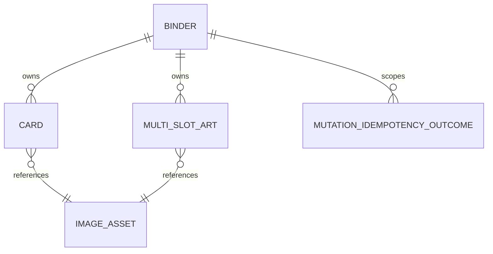

# Data Types Reference

This is a story-derived inventory of the application's objects and properties, drawn
from the story files under [docs/stories/](stories/) (see
[docs/stories/README.md](stories/README.md) for the full index). It is not a database
schema or generated API type definition. The OpenAPI specification and selected
database technology will remain authoritative during implementation.

Fields marked **TBD** are required by planned behavior but do not yet have a settled
shape, name, or persistence contract in the relevant story file under
[docs/stories/](stories/).

## Shared Conventions

- Identifiers are backend-generated UUIDs unless stated otherwise.
- Timestamps are backend-managed UTC timestamps.
- Physical placement coordinates are one-based `physicalPage`, `row`, and `column`.
- A placement coordinate triple is either entirely populated or entirely `null` for an
  unplaced item.
- REST contracts use human-readable decimal units. The database stores centimeters as
  integer hundredths of a centimeter and percentage points as integer hundredths to
  avoid floating-point drift.
- User-facing backend failures use Problem Details JSON.

## Core Domain Objects

### Binder

| Property              | Type                      | Required | Notes                                                                                                                                                                                          |
| --------------------- | ------------------------- | -------- | ---------------------------------------------------------------------------------------------------------------------------------------------------------------------------------------------- |
| `id`                  | UUID                      | Yes      | Backend-generated binder identifier used in the database, API, routes, and full-data export.                                                                                                   |
| `name`                | string                    | Yes      | Trimmed, 1 to 100 characters, case-insensitively unique.                                                                                                                                       |
| `width`               | positive integer          | Yes      | Number of slot columns per binder side; `1` to `8`, default `3`.                                                                                                                               |
| `height`              | positive integer          | Yes      | Number of slot rows per binder side; `1` to `8`, default `3`.                                                                                                                                  |
| `pages`               | positive integer          | Yes      | Stored binder-page count; default `20`. Physical pages range from `1` through `2 * pages`.                                                                                                     |
| `previewPhysicalPage` | positive integer          | Yes      | One-based physical focal page for the home-page preview; default `2`.                                                                                                                          |
| `locked`              | boolean                   | Yes      | Defaults to `false`; blocks restricted details and layout mutations.                                                                                                                           |
| `notes`               | Markdown string or `null` | Yes      | Up to 1,000,000 characters. Exactly empty input normalizes to `null`; nonempty input preserves whitespace.                                                                                     |
| `widthPerSlot`        | decimal centimeters       | Yes      | Greater than zero; default `6.85`.                                                                                                                                                             |
| `widthBase`           | decimal centimeters       | Yes      | Default `-0.5`; may be negative only when the one-slot computed width remains positive.                                                                                                        |
| `heightPerSlot`       | decimal centimeters       | Yes      | Greater than zero; default `9`.                                                                                                                                                                |
| `heightBase`          | decimal centimeters       | Yes      | Default `0`; may be negative only when the one-slot computed height remains positive.                                                                                                          |
| `borderColor`         | `#RRGGBB` string          | Yes      | Six-digit uppercase hexadecimal color; default `#FFCB05`.                                                                                                                                      |
| `borderRadius`        | decimal percentage        | Yes      | `0` through `100`; default `38`.                                                                                                                                                               |
| `borderWidth`         | decimal centimeters       | Yes      | `0` or greater; default `0.25`. A physical measurement (not a percentage or fixed pixel count) converted to pixels at render time using the same cm-to-px scale factor as the art's own image. |
| `selectedBinderCostEntryId`             | UUID or `null`   | Yes      | Selected `BinderCostEntry` for this binder's Finances tab; nulled server-side when a width/height/pages change no longer matches the selected entry's stored dimensions.                        |
| `selectedPrintingCostEntryId`           | UUID or `null`   | Yes      | Selected `PrintingCostEntry` for this binder's Finances tab.                                                                                                                                     |
| `selectedHolographicPaperCostEntryId`   | UUID or `null`   | Yes      | Selected `HolographicPaperCostEntry` for this binder's Finances tab.                                                                                                                             |
| `cachedArtPrintPageCount`               | nonnegative integer | Yes  | Cached result of `GET /binders/{binderId}/art-print-page-count`, recomputed only when the cache signature below no longer matches.                                                              |
| art-print page-count cache signature    | derived value    | Yes      | `COUNT` of currently-placed art rows plus `MAX(updatedAt)` across them plus the binder's own `updatedAt`; not a stored column, computed on read to detect staleness cheaply.                    |
| `createdAt`           | UTC timestamp             | Yes      | Backend-managed.                                                                                                                                                                               |
| `updatedAt`           | UTC timestamp             | Yes      | Backend-managed; changes when lock state changes.                                                                                                                                              |

**Relationships:** A binder owns cards and multi-slot art. It references neither image
files nor image-asset storage paths directly. It also optionally references one shared
`BinderCostEntry`, `PrintingCostEntry`, and `HolographicPaperCostEntry` (Story 34).

### PlacementCoordinates

| Property       | Type                       | Required | Notes                                          |
| -------------- | -------------------------- | -------- | ---------------------------------------------- |
| `physicalPage` | positive integer or `null` | Yes      | Valid range is `1` through `2 * binder.pages`. |
| `row`          | positive integer or `null` | Yes      | Must be within the binder height.              |
| `column`       | positive integer or `null` | Yes      | Must be within the binder width.               |

For cards, this identifies one slot. For multi-slot art, it is the top-left anchor and
the remaining covered slots are derived from the art's slot width and height.

### Card

| Property         | Type                   | Required     | Notes                                                                                                                     |
| ---------------- | ---------------------- | ------------ | ------------------------------------------------------------------------------------------------------------------------- |
| `id`             | UUID                   | Yes          | Backend-generated card identifier.                                                                                        |
| `binderId`       | UUID                   | Yes          | Owning binder.                                                                                                            |
| `name`           | string                 | Yes          | Card name. Custom-card names are trimmed and limited to 100 characters.                                                   |
| `setName`        | string or `null`       | Yes          | Stored separately; custom values are trimmed and limited to 100 characters.                                               |
| `localNumber`    | string or `null`       | Yes          | Stored separately; custom values are trimmed and limited to 50 characters. Manual-entry UI may label this field `number`. |
| `source`         | enum                   | Yes          | Initially `tcgdex` or `custom`.                                                                                           |
| `providerCardId` | string                 | Conditional  | Required for `tcgdex`; absent for `custom`.                                                                               |
| `providerSetId`  | string                 | Conditional  | Required for `tcgdex`; absent for `custom`.                                                                               |
| `variation`      | string or `null`       | Yes          | Trimmed; blank normalizes to `null`; maximum 50 characters. One value replaces the previous value.                        |
| `placement`      | `PlacementCoordinates` | Yes          | All coordinates are populated for placed cards and all are `null` for unplaced cards.                                     |
| `imageUrl`       | URL string             | API only     | Derived endpoint URL for the shared image asset; changes when the underlying asset changes.                               |
| `imageAsset`     | `ImageAsset` reference | Backend only | Exact exposed property name is **TBD**; storage identifiers and filenames are never exposed to the frontend.              |
| `createdAt`      | UTC timestamp          | Yes          | Used for deterministic unplaced-item ordering.                                                                            |
| `updatedAt`      | UTC timestamp          | Expected     | New card instances receive backend-managed UTC timestamps; exact serialization key is **TBD**.                            |
| `acquired`       | boolean                | Yes          | Defaults to `false`. Updated via `PATCH /cards/{cardId}` with `{ "acquired": boolean }`; optionally set at creation time through `POST /binders/{binderId}/cards` or the shared checkbox in `POST /binders/{binderId}/cards/bulk` (Story 36). |
| `price`          | positive currency (integer cents) or `null` | Yes | Saved card price; `null` until first fetched or manually entered. Updated only through `PATCH /binders/{binderId}/cards/prices` (Story 38). |
| `isManualPrice`  | boolean                | Yes          | Defaults to `false`. `true` when `price`'s value was hand-edited rather than auto-filled from an unedited market/lowest price; a re-confirmed manual price (auto-filled from the currently saved price and left unedited) keeps its existing value rather than resetting (Story 38). |
| `priceUpdatedAt` | UTC timestamp or `null` | Yes         | Set whenever `price` changes; displayed alongside `price` on the Card Checklist (Story 38).                               |

**Constraints:** At most one card may occupy a binder and placement-coordinate triple.
Card deletion cascades dependent variation, acquisition, checklist, and pricing data.

### MultiSlotArt

| Property                               | Type                          | Required     | Notes                                                                                                                                             |
| -------------------------------------- | ----------------------------- | ------------ | ------------------------------------------------------------------------------------------------------------------------------------------------- |
| `id`                                   | UUID                          | Yes          | Backend-generated art identifier.                                                                                                                 |
| `binderId`                             | UUID                          | Yes          | Owning binder.                                                                                                                                    |
| `title`                                | string                        | Yes          | Trimmed and required; maximum 100 characters.                                                                                                     |
| `description`                          | string or `null`              | Yes          | Optional; maximum 10,000 characters; blank normalizes to `null`.                                                                                  |
| `widthSlots`                           | positive integer              | Yes          | Selected width in binder slots.                                                                                                                   |
| `heightSlots`                          | positive integer              | Yes          | Selected height in binder slots.                                                                                                                  |
| `placement`                            | `PlacementCoordinates`        | Yes          | Top-left anchor when placed; all coordinates are `null` when unplaced.                                                                            |
| `imageFocalX`                          | normalized decimal            | Yes          | Focal coordinate relative to the centered-cover fit. Rounded to four decimal places.                                                              |
| `imageFocalY`                          | normalized decimal            | Yes          | Focal coordinate relative to the centered-cover fit. Rounded to four decimal places.                                                              |
| `imageScaleX`                          | normalized decimal            | Yes          | Independent horizontal scale multiplier relative to centered cover. Rounded to four decimal places.                                               |
| `imageScaleY`                          | normalized decimal            | Yes          | Independent vertical scale multiplier relative to centered cover. Rounded to four decimal places.                                                 |
| `imageRotationDegrees`                 | enum integer                  | Yes          | One of `0`, `90`, `180`, or `270`. Rotation applies to the image only, not the frame footprint.                                                   |
| `borderColorOverride`                  | `#RRGGBB` string or `null`    | Yes          | `null` means use the current binder border color.                                                                                                 |
| `borderRadiusOverride`                 | decimal percentage or `null`  | Yes          | `null` means use the current binder radius.                                                                                                       |
| `borderWidthOverride`                  | decimal centimeters or `null` | Yes          | `null` means use the current binder width.                                                                                                        |
| `imageUrl`                             | URL string                    | API only     | Resolves the normalized rendering image, not a storage path.                                                                                      |
| source and normalized image references | `ImageAsset` references       | Backend only | The plan requires original source bytes and, when needed, an orientation-normalized derivative. Exact field names and representation are **TBD**. |
| `createdAt`                            | UTC timestamp                 | Yes          | Used for deterministic mixed unplaced-item ordering.                                                                                              |
| `updatedAt`                            | UTC timestamp                 | Expected     | Exact serialization key is **TBD**.                                                                                                               |

**Constraints:** Placed art must fit within one binder side, cannot span physical pages,
and cannot overlap a card or other art. The transformed image must cover the complete
inner frame without gaps. Changing the selected image or slot dimensions resets rotation
to `0` and resets other manual transforms to centered cover.

### ImageAsset

`ImageAsset` is a shared immutable backend record and local file used by custom cards,
TCGdex cards, and multi-slot art. Its exact schema is not yet settled.

| Required attribute                          | Type                                   | Notes                                                                              |
| ------------------------------------------- | -------------------------------------- | ---------------------------------------------------------------------------------- |
| asset identifier                            | UUID or internal identifier            | Exact field name is **TBD**; not exposed to the frontend.                          |
| storage reference and generated filename    | string                                 | Used only by the backend for filesystem operations.                                |
| detected content type                       | MIME type                              | JPEG, PNG, or WebP; detected from bytes rather than response headers or filenames. |
| detected file extension                     | string                                 | Derived from validated bytes.                                                      |
| SHA-256 digest                              | string                                 | Used to deduplicate custom uploads and art uploads.                                |
| provider source and provider card ID        | conditional values                     | Used to deduplicate concurrent TCGdex image downloads.                             |
| sanitized original filename                 | string or `null`                       | Stored for custom uploads as metadata only.                                        |
| original source file                        | local file reference                   | Exact uploaded or downloaded bytes remain available.                               |
| orientation-normalized rendering derivative | local file reference or related record | Created when JPEG EXIF orientation requires it; exact representation is **TBD**.   |

### FinanceSettings

A single global singleton record (Story 34) shared across every binder; no per-record ID
is exposed in the API.

| Property             | Type              | Required | Notes                                                                                                                     |
| -------------------- | ----------------- | -------- | -------------------------------------------------------------------------------------------------------------------------- |
| `wagePerHour`        | nonnegative currency (integer cents) | Yes | Shared across all binders' time-based cost calculations; default `0`.                                       |
| `errorMarginPercent` | integer percentage, `0` to `100` | Yes | Defaults to `10`; shared across all binders and applied to Printing and Holographic Paper costs as `ceil(pageCount * errorMarginPercent / 100)` extra whole pages. |
| rate basis per time-cost category | nested record, one per category | Yes | Each of the 5 fixed categories (`designing`, `printing`, `applyingHolographicPaper`, `cutting`, `placing`) holds its own `referenceMinutes` (nonnegative integer, default `0`) and `referencePages` (positive integer, default `1`). |

**Constraints:** The 5 time-cost categories are a fixed enum baked into schema and code;
adding, renaming, or removing one requires a future code change and migration, not an
in-app action. The initial row's seed values are set directly in the database
migration/seed rather than in the shared `defaults.ts`, as a documented one-off exception
to the `defaults.ts` centralization convention.

### BinderCostEntry

A shared, reusable catalog entry (Story 34) selectable from any binder's Finances tab.

| Property | Type                        | Required | Notes                                                                                     |
| -------- | --------------------------- | -------- | ------------------------------------------------------------------------------------------ |
| `id`     | UUID                        | Yes      | Backend-generated.                                                                        |
| `name`   | string                      | Yes      | Trimmed, 1 to 100 characters; duplicate names across entries are allowed.                 |
| `price`  | positive currency (integer cents) | Yes | Shown to the user.                                                                         |
| `width`  | positive integer, `1` to `8` | Yes     | Hidden from the user; used only to filter the dropdown to binders with matching dimensions. |
| `height` | positive integer, `1` to `8` | Yes     | Hidden from the user; same filtering role as `width`.                                     |
| `pages`  | positive integer             | Yes     | Hidden from the user; same filtering role as `width`/`height`.                             |
| `binderCount` | nonnegative integer      | API only | Count of binders currently using this entry as `selectedBinderCostEntryId`; shown in the "Manage cost entries" modal (Story 44), not persisted on the entry itself. |

### PrintingCostEntry

A shared, reusable catalog entry (Story 34) selectable from any binder's Finances tab.

| Property        | Type                          | Required | Notes                                                                    |
| --------------- | ------------------------------ | -------- | --------------------------------------------------------------------------- |
| `id`            | UUID                           | Yes      | Backend-generated.                                                          |
| `name`          | string                         | Yes      | Trimmed, 1 to 100 characters; duplicate names across entries are allowed.  |
| `pricePerPage`  | positive currency (integer cents) | Yes  | Cost is `pricePerPage * pageCount` (art-print-PDF page count for this binder). |
| `binderCount`   | nonnegative integer            | API only | Count of binders currently using this entry as `selectedPrintingCostEntryId`; shown in the "Manage cost entries" modal (Story 44), not persisted on the entry itself. |

### HolographicPaperCostEntry

A shared, reusable catalog entry (Story 34) selectable from any binder's Finances tab.

| Property         | Type                          | Required | Notes                                                                                            |
| ---------------- | ------------------------------ | -------- | --------------------------------------------------------------------------------------------------- |
| `id`             | UUID                           | Yes      | Backend-generated.                                                                                  |
| `name`           | string                         | Yes      | Trimmed, 1 to 100 characters; duplicate names across entries are allowed.                          |
| `price`          | positive currency (integer cents) | Yes  | Total price for a pack of `pagesIncluded` pages.                                                    |
| `pagesIncluded`  | positive integer               | Yes      | Cost is `(price / pagesIncluded) * pageCount` (art-print-PDF page count for this binder).            |
| `binderCount`    | nonnegative integer            | API only | Count of binders currently using this entry as `selectedHolographicPaperCostEntryId`; shown in the "Manage cost entries" modal (Story 44), not persisted on the entry itself. |

## Derived API Representations

### BinderSummary

Returned by `GET /binders` and binder duplication. It contains a lightweight subset of
the binder graph.

| Property                                                                     | Type            | Notes                                                                                     |
| ---------------------------------------------------------------------------- | --------------- | ----------------------------------------------------------------------------------------- |
| `id`, `name`, `width`, `height`, `pages`, `locked`, `createdAt`, `updatedAt` | Binder fields   | Base summary fields.                                                                      |
| preview spread                                                               | `PreviewSpread` | Selected preview page or spread with only display data required for the miniature layout. |
| `totalSlots`                                                                 | integer         | Canonical slot count.                                                                     |
| `occupiedSlots`                                                              | integer         | Cards plus art-covered slots.                                                             |
| `emptySlots`                                                                 | integer         | Total minus occupied slots.                                                               |
| `acquiredCards`                                                              | integer         | Number of card records with `acquired = true` (Story 36); counts placed and unplaced cards and excludes art. |
| `totalCards`                                                                 | integer         | All binder-owned card records, placed and unplaced.                                       |

The client derives rounded slot-completion and card-acquisition percentages. Card
acquisition percentage is `null` and displays as `N/A` when `totalCards` is zero.

### PreviewSpread

| Property             | Type                          | Notes                                                                    |
| -------------------- | ----------------------------- | ------------------------------------------------------------------------ |
| spread identity      | physical-page value or values | Exact nested shape is **TBD**.                                           |
| placed-card geometry | collection                    | Includes only placement geometry, card display metadata, and image URLs. |
| placed-art geometry  | collection                    | Includes only placement geometry, art display metadata, and image URLs.  |

It excludes image bytes and unrelated binder records. Variation labels, Michi indicators,
acquisition state, pending-operation feedback, and editing controls are not rendered.

## API Request and Response Objects

### CreateBinderRequest

| Property                                                   | Type                         | Required                                                    |
| ---------------------------------------------------------- | ---------------------------- | ----------------------------------------------------------- |
| `name`                                                     | string                       | Yes                                                         |
| `width`                                                    | positive integer, `1` to `8` | Yes                                                         |
| `height`                                                   | positive integer, `1` to `8` | Yes                                                         |
| `pages`                                                    | positive integer             | Yes                                                         |
| `widthPerSlot`, `widthBase`, `heightPerSlot`, `heightBase` | corresponding Binder fields  | No; defaults to the shared dimension defaults when omitted. |
| `borderColor`, `borderRadius`, `borderWidth`               | corresponding Binder fields  | No; defaults to the shared art-style defaults when omitted. |

`POST /binders` returns `201 Created`, a `Location` header, and the complete `Binder`.

### UpdateBinderRequest

This is a partial request. It may contain any valid dirty binder field plus the
resize-confirmation flag when needed.

| Property                                                   | Type                        | Notes                                                  |
| ---------------------------------------------------------- | --------------------------- | ------------------------------------------------------ |
| `name`, `width`, `height`, `pages`                         | corresponding Binder fields | Standard detail updates.                               |
| `previewPhysicalPage`, `locked`, `notes`                   | corresponding Binder fields | Metadata updates.                                      |
| `widthPerSlot`, `widthBase`, `heightPerSlot`, `heightBase` | corresponding Binder fields | Dimension updates.                                     |
| `borderColor`, `borderRadius`, `borderWidth`               | corresponding Binder fields | Binder art-style updates.                              |
| `moveAffectedItemsToUnplaced`                              | boolean                     | Only present after confirmed affected-item relocation. |

### ResizePreviewRequest and ResizePreviewResult

| Object                 | Properties                                                                                                                                                  |
| ---------------------- | ----------------------------------------------------------------------------------------------------------------------------------------------------------- |
| `ResizePreviewRequest` | `width`, `height`, `pages` proposed values.                                                                                                                 |
| `ResizePreviewResult`  | `affectedCardIds`, `affectedArtIds`, `affectedCardCount`, `affectedArtCount`. Exact field names are **TBD**; the plan requires the IDs and separate counts. |

### TcgDexCatalogCard

The normalized response object from `GET /card-catalog/search` and JSON source for TCGdex
card creation.

| Property         | Type             | Notes                                                                                                     |
| ---------------- | ---------------- | --------------------------------------------------------------------------------------------------------- |
| `name`           | string           | Card display name.                                                                                        |
| `setName`        | string or `null` | Provider set name.                                                                                        |
| `localNumber`    | string or `null` | Provider local card number.                                                                               |
| `providerCardId` | string           | TCGdex card ID.                                                                                           |
| `providerSetId`  | string           | TCGdex set ID.                                                                                            |
| image location   | URL string       | Used by the backend to obtain the image from an approved origin. Exact response property name is **TBD**. |

The backend preserves the provider's result ordering and returns all matches without
application-level pagination or truncation.

### CardSearchResponse

`GET /card-catalog/search`'s response body (story 41): wraps the normalized results with a
nonblocking translation-warning flag instead of returning a bare array.

| Property             | Type                  | Notes                                                                                                                                |
| -------------------- | --------------------- | ------------------------------------------------------------------------------------------------------------------------------------ |
| `results`            | `TcgDexCatalogCard[]` | The normalized search results.                                                                                                       |
| `translationWarning` | boolean               | `true` only when `language=ja` and no PokéAPI translation was found for the query, so the original entered query was searched as-is. |

`POST /binders/{binderId}/cards` supports one variant.

| Variant                    | Properties                                                                                                                                                                    |
| -------------------------- | ----------------------------------------------------------------------------------------------------------------------------------------------------------------------------- |
| Custom multipart form data | `name`, optional `setName`, optional `localNumber`, optional `variation`, optional placement coordinates, and one required image file. The backend sets `source` to `custom`. |

TCGdex-card creation, including for a single selected card, uses
`POST /binders/{binderId}/cards/bulk` (`BulkCreateCardsRequest` below) instead; there is
no single-card TCGdex JSON variant of this endpoint.

A successful custom-card creation returns `201 Created`, a card `Location` header, and
the persisted `Card`.

### CardPositionUpdate and UpdateCardRequest

| Object               | Properties                                                                                                                                                                   |
| -------------------- | ---------------------------------------------------------------------------------------------------------------------------------------------------------------------------- |
| `CardPositionUpdate` | Card ID; final nullable `physicalPage`, `row`, and `column`; expected nullable `physicalPage`, `row`, and `column`. The exact JSON nesting is **TBD**.                       |
| `UpdateCardRequest`  | One position update for a move, two updates for a swap, or nullable `variation` for a variation edit. The path card ID must identify the dragged card in a movement request. |

Movement checks all expected coordinates and applies every final coordinate in one
transaction. A successful move returns all changed cards; a variation update returns the
updated card.

### BulkCreateCardsRequest and BulkCardOutcome

| Object                   | Properties                                                                                                                                                                                                                              |
| ------------------------ | --------------------------------------------------------------------------------------------------------------------------------------------------------------------------------------------------------------------------------------- |
| `BulkCreateCardsRequest` | Array of the user-selected `TcgDexCatalogCard` values (in search-result order), optional shared `variation`, optional target `PlacementCoordinates` applied only to the first array element, and client-generated UUID idempotency key. |
| `BulkCardOutcome`        | One result per submitted card, in submitted order; successful results include the created `Card`, and failed results include that card's Problem Details data. Exact field names are **TBD**.                                           |

Bulk creation targets unplaced coordinates for every array element except the first,
which is attempted at the optional target placement (used only when the modal was
opened from an empty binder slot); if that attempt fails, no other card claims the slot.
It returns `201 Created` when every card succeeds and `207 Multi-Status` for any
card-level failure.

### CreateArtRequest and UpdateArtRequest

Both requests use multipart form data.

| Object             | Properties                                                                                                                                                                                                                                                                                                  |
| ------------------ | ----------------------------------------------------------------------------------------------------------------------------------------------------------------------------------------------------------------------------------------------------------------------------------------------------------- |
| `CreateArtRequest` | `title`, optional `description`, `widthSlots`, `heightSlots`, optional `PlacementCoordinates`, `ArtImageTransform`, nullable style overrides, and required image file.                                                                                                                                      |
| `UpdateArtRequest` | Updated metadata, placement expectation and final placement for movement, optional replacement image file, `ArtImageTransform`, nullable style overrides, and confirmed placement clearing when the edited footprint becomes invalid. Exact property names for movement and placement clearing are **TBD**. |

### ArtImageTransform

| Property               | Type                       |
| ---------------------- | -------------------------- |
| `imageFocalX`          | normalized decimal         |
| `imageFocalY`          | normalized decimal         |
| `imageScaleX`          | normalized decimal         |
| `imageScaleY`          | normalized decimal         |
| `imageRotationDegrees` | `0`, `90`, `180`, or `270` |

### ArtStyleOverrides

| Property               | Type                  | Notes                               |
| ---------------------- | --------------------- | ----------------------------------- |
| `borderColorOverride`  | `#RRGGBB` or `null`   | `null` inherits the binder setting. |
| `borderRadiusOverride` | percentage or `null`  | `null` inherits the binder setting. |
| `borderWidthOverride`  | centimeters or `null` | `null` inherits the binder setting. |

### PdfExportOptions

| Property            | Type    | Notes                                                                                                           |
| ------------------- | ------- | ------------------------------------------------------------------------------------------------------------- |
| `includeVariations` | boolean | Optional for binder-layout PDF export; defaults to `false`. It is set from the current layout variation toggle. |

### CardChecklistState (Story 37)

Client-only, derived entirely from the already-loaded `cards` array in
`BinderRouteContext`; none of this state is sent to or stored by the backend except as
the resolved `cardIds` array in `CardsPdfExportRequest` below.

| Property        | Type                                                                 | Notes                                                                                                                                                       |
| ---------------- | --------------------------------------------------------------------- | ------------------------------------------------------------------------------------------------------------------------------------------------------------ |
| `searchQuery`     | string                                                                | Trimmed, case-insensitive; matches as a substring of `name`, `setName`, `localNumber`, or `variation` (OR logic).                                            |
| `sortOption`      | enum: `name`, `set`, `number`, `setAndNumber`, `acquisition`          | Defaults to `setAndNumber`. Ties fall back to `Card.createdAt` ascending.                                                                                    |
| `sortDirection`   | enum: `ascending`, `descending`                                       | Toggled by clicking the active column's header; a `null`/missing `setName` or `localNumber` always sorts last regardless of direction.                       |
| `columnFilters`   | one value-set per column: `name`, `set`, `number`, `acquisition`     | Each is a set of selected distinct values for that column (a dedicated `"(None)"` entry represents `null`); defaults to every distinct value selected.        |

Column filters combine with each other and the search query using AND logic. The
progress tracker (acquired/total/percentage) always reflects every card in the binder,
unaffected by any of this state.

### CardsPdfExportRequest (Story 37)

| Property  | Type       | Notes                                                                                                                    |
| --------- | ---------- | --------------------------------------------------------------------------------------------------------------------------- |
| `cardIds` | `string[]` | The client's currently filtered and sorted card IDs, in display order; the backend renders exactly these cards, in this order, without recomputing search, sort, or filter state. |

### HealthResponse

| Property      | Type    | Notes                                                                                                 |
| ------------- | ------- | ----------------------------------------------------------------------------------------------------- |
| health status | **TBD** | `GET /health` requires an OpenAPI-documented JSON response, but its field shape is not yet specified. |

### ProblemDetails

| Property              | Type    | Notes                                                              |
| --------------------- | ------- | ------------------------------------------------------------------ |
| `type`                | string  | Stable problem type retained for diagnostics.                      |
| `status`              | integer | HTTP response status retained for diagnostics.                     |
| `detail`              | string  | User-facing failure detail used by failed toasts.                  |
| other RFC 9457 fields | **TBD** | The complete OpenAPI Problem Details schema remains to be defined. |

## Supporting Persisted Records

### MutationIdempotencyOutcome

Used for bulk card creation and card, art, and binder duplication. Lock state updates use
idempotent desired-state retry instead and do not require a UUID idempotency key.

| Property        | Type                           | Notes                                                                                             |
| --------------- | ------------------------------ | ------------------------------------------------------------------------------------------------- |
| idempotency key | UUID                           | Client-generated; exact property name is **TBD**.                                                 |
| operation scope | identifiers and operation type | Scopes replay to the appropriate binder, card, or art operation. Exact representation is **TBD**. |
| stored outcome  | response payload and status    | Replayed for a repeated key without duplicating data. Exact storage shape is **TBD**.             |
| expiry          | UTC timestamp                  | Retained for `MUTATION_IDEMPOTENCY_RETENTION_MS`, default 24 hours.                               |

### PendingFileCleanup

Created when post-commit removal of an unreferenced image file fails.

| Property           | Type             | Notes                                                                                       |
| ------------------ | ---------------- | ------------------------------------------------------------------------------------------- |
| orphaned file path | local path       | Exact storage field name is **TBD**.                                                        |
| cleanup error      | diagnostic value | Exact storage field name and structure are **TBD**.                                         |
| retry state        | **TBD**          | The backend retries pending cleanup work, but scheduling and record fields are not defined. |

## Client-Only State

### BinderRouteContext

| Property                 | Type             | Notes                                                                                 |
| ------------------------ | ---------------- | ------------------------------------------------------------------------------------- |
| `binder`                 | `Binder`         | Shared details response.                                                              |
| `cards`                  | `Card[]`         | Shared cards response.                                                                |
| `art`                    | `MultiSlotArt[]` | Shared art response.                                                                  |
| loading and error state  | UI state         | Published only after all three loads succeed. Exact property names are **TBD**.       |
| local optimistic updates | UI state         | Retained while nested tabs switch. Exact representation is **TBD**.                   |
| last layout focal page   | positive integer | Route-local state used to restore the layout `page` query after visiting another tab. |

### LayoutRouteState

| Query property | Type             | Notes                                                          |
| -------------- | ---------------- | --------------------------------------------------------------- |
| `page`         | positive integer | Focal physical page; defaults to `1` when absent or invalid.  |

Michi-indicator, variation-label, notes, and card-acquisition visibility are not part of
this route state (despite stories 10, 16, and 29's original text describing `michi` and
`variations` as route query parameters) — all four are persisted browser local-storage
preferences; see `LayoutVisibilityPreferences` below.

### LayoutVisibilityPreferences

Four independent presentation-only preferences for the Edit Layout tab, each its own
browser local-storage boolean (not the backend or a route query parameter), remembered
across binders and reloads.

| Property                 | Local storage key                     | Notes                                                                                                          |
| ------------------------- | -------------------------------------- | ---------------------------------------------------------------------------------------------------------------- |
| `michiIndicatorsVisible`  | `binder-layout-michi-visible`          | Defaults to `DEFAULT_BINDER_MICHI_INDICATORS_VISIBLE` (Story 10).                                              |
| `variationsVisible`       | `binder-layout-variations-visible`     | Defaults to `DEFAULT_BINDER_VARIATIONS_VISIBLE` (Story 16); also read by the layout PDF export's `includeVariations` (Story 29), which no longer reads a `variations=true` route parameter. |
| `notesVisible`            | `binder-notes-visible`                 | Defaults to `DEFAULT_BINDER_NOTES_VISIBLE` (Story 23).                                                          |
| `acquisitionStatusVisible`| **TBD** (Story 36)                     | Defaults to hidden until a preference is saved.                                                                 |

### HomePagePreference

| Property                   | Type    | Notes                                                                                             |
| -------------------------- | ------- | ------------------------------------------------------------------------------------------------- |
| `completionMetricsVisible` | boolean | Stored in browser local storage, not the backend; initially visible before a preference is saved. |

### UnplacedItemFilterState

| Property         | Type   | Notes                                           |
| ---------------- | ------ | ----------------------------------------------- |
| `searchQuery`    | string | Trimmed terms filter cards and art client-side. |
| `itemTypeFilter` | enum   | `all`, `cards`, or `art`.                       |

This state is local to the mounted layout tab. It resets after leaving or refreshing the
layout and is not persisted to the URL, browser storage, binder context, or backend.

### LayoutMovementHistory

| Property       | Type                 | Notes                                                                                                  |
| -------------- | -------------------- | ------------------------------------------------------------------------------------------------------ |
| undo stack     | movement entry array | Contains successful card moves, swaps, and art moves.                                                  |
| redo stack     | movement entry array | Contains previously undone movements.                                                                  |
| movement entry | **TBD** record       | Must retain affected item IDs, prior positions, final positions, and the focal dragged card for swaps. |

It is binder-scoped React state, capped at `LAYOUT_MOVEMENT_HISTORY_LIMIT` (default 50),
and resets on binder-route unmount, page refresh, or a full binder reload.

### ToastOperation

| Property             | Type                | Notes                                                                            |
| -------------------- | ------------------- | -------------------------------------------------------------------------------- |
| operation identifier | unique value        | Every concurrent mutation has its own identifier. Exact shape is **TBD**.        |
| state                | enum                | `saving`, `saved`, or `failed`.                                                  |
| error detail         | string or `null`    | Uses Problem Details `detail` for failures.                                      |
| dismissal behavior   | derived UI behavior | Saved state dismisses after 3 seconds; failed state requires explicit dismissal. |

## Planned Types Still to Define

| Area                           | Required future types or fields                                                                                                                   |
| ------------------------------ | ------------------------------------------------------------------------------------------------------------------------------------------------- |
| Full-data export and import    | Archive manifest, schema-version record, archive entry inventory, identifier and storage-path remapping, import preview, and transaction outcome. |

## Relationship Summary

The exact database technology, table names, image-derivative representation, and
archive schema remain open decisions.
